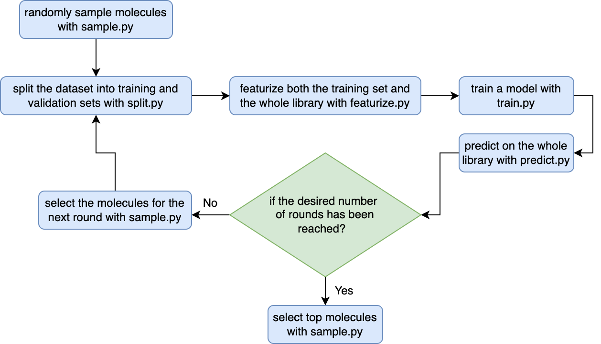

# Active Learning for Docking
This repository contains the code for using active learning to speed up molecular docking. 

## Setup Environment
```
conda create --name al4docking -c anaconda python=3.10
conda activate al4docking
pip install -r requirements.txt
```
## Usage
The overall workflow is decribed by the chart below:   



For more detailed information about running those scripts, please refer to the [`proj_template`](proj_template) directory.